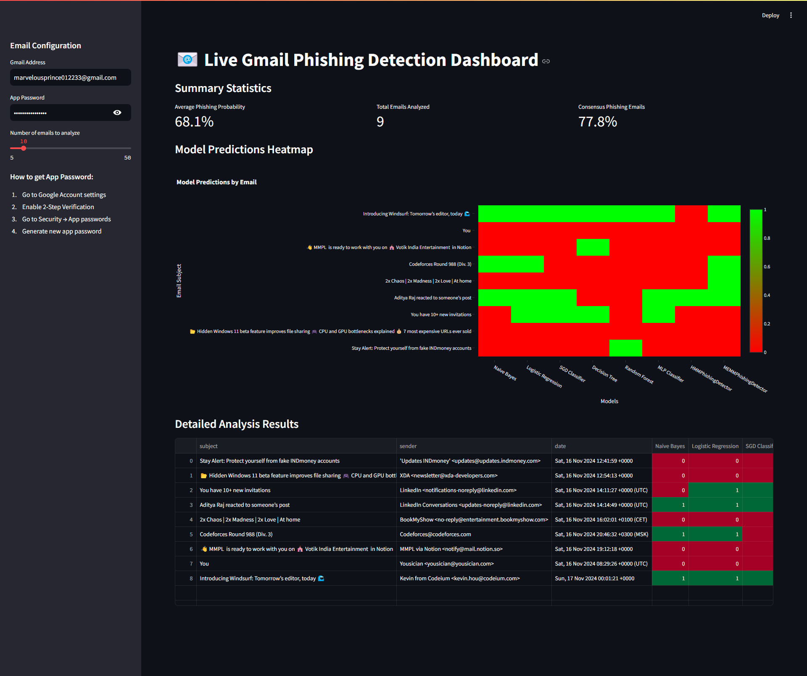
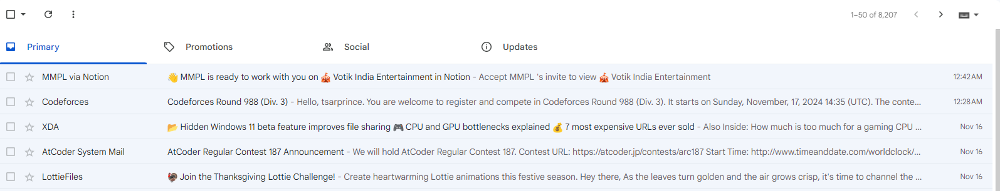
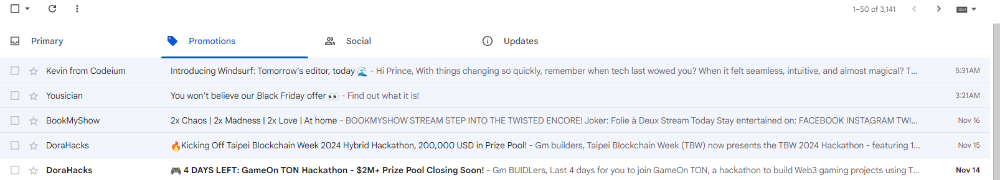
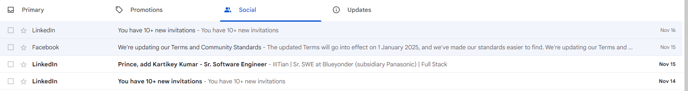
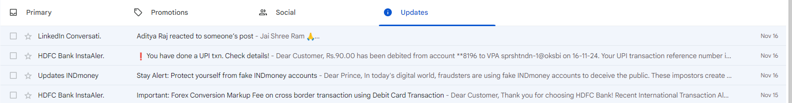

# To Run:

- `git clone https://github.com/TsarPrince/better-phishing-detector`

- Download models and vectorizer from https://drive.google.com/drive/u/1/folders/1Xvu0R1rwO_rKVwqt2ixpP3qJ6TBPCRDD and populate the `models` folder

- Install necessary libraries ;)

  Must be `pip install hmmlearn seaborn plotly` if you already have basic ML libbraries like numpy, panads, tensorflow etc already installed

- `py -m streamlit run dashboard.py`

- Visit http://localhost:8501/

- Generate your Google Gmail credentials from https://myaccount.google.com/apppasswords

- Enter credentials in Streamlit Dashboard's sidebar. Done! 🎉🎊🪅

# Preview

| category   | mails                                 |
| ---------- | ------------------------------------- |
| Primary    |     |
| Promotions |  |
| Social     |      |
| Updates    |     |

# Additional Details

- Training code - https://colab.research.google.com/drive/1Ua51-Qu1MlruYjbXdlHR4Z47C-JspWDd

- Testing code - https://colab.research.google.com/drive/1JGvJK3w7MGvaDyPeC1lBV8uhbWjL-b4l
